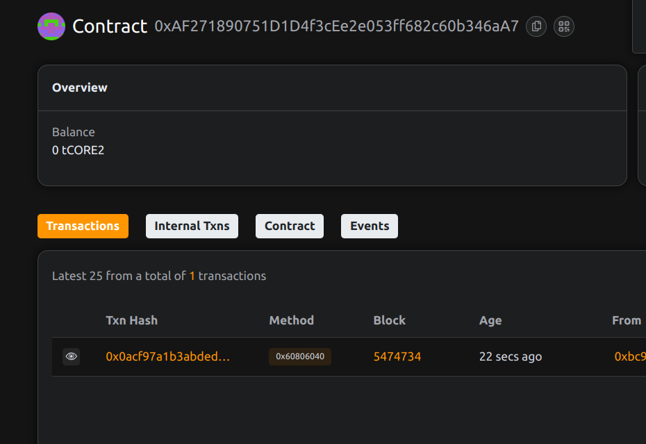

# YieldLock: Locked Yield Farming Contracts for Vesting Liquidity

## Project Description

YieldLock is a sophisticated DeFi protocol that combines yield farming with time-locked liquidity and vesting mechanisms. The platform allows users to stake LP tokens in farming pools with mandatory lock periods, where rewards are automatically vested over time to ensure long-term commitment and platform stability. This innovative approach promotes sustainable yield farming while reducing mercenary capital and encouraging genuine community participation.

## Project Vision

Our vision is to create a more stable and sustainable yield farming ecosystem by introducing time-locked staking and vested rewards. We aim to attract long-term liquidity providers who are genuinely committed to the protocol's success, thereby reducing volatility and creating a more predictable and reliable DeFi environment for all participants.

## Key Features

- **Time-Locked Staking**: Mandatory lock periods for staked LP tokens to ensure commitment
- **Vested Reward System**: Rewards are distributed through vesting schedules with cliff periods
- **Multiple Farm Pools**: Support for various LP tokens with different reward rates and lock durations
- **Flexible Pool Management**: Admin controls for creating and managing farming pools
- **Automated Vesting**: Smart contract-based vesting eliminates the need for manual intervention
- **Early Unlock Protection**: Prevents early withdrawal during lock periods to maintain stability
- **Compound Growth**: Locked tokens continue earning rewards throughout the lock period

## Future Scope

- **Dynamic Lock Periods**: Allow users to choose lock duration with corresponding reward multipliers
- **Governance Token Integration**: Implement governance tokens for protocol decision-making
- **Boost Mechanisms**: NFT or token-based boost systems for enhanced rewards
- **Cross-Chain Farming**: Expand to multiple blockchains for diversified farming opportunities
- **Advanced Vesting Options**: Multiple vesting schedule types (linear, exponential, step-based)
- **Liquidity Mining Programs**: Special programs for new token launches and partnerships
- **Insurance Integration**: Optional insurance for staked assets against smart contract risks
- **Mobile Dashboard**: Mobile application for farm management and reward tracking
- **Social Features**: Community features for sharing strategies and farming insights
- **Analytics Platform**: Comprehensive analytics for tracking farm performance and APY trends

## Contract Details
0xAF271890751D1D4f3cEe2e053ff682c60b346aA7
